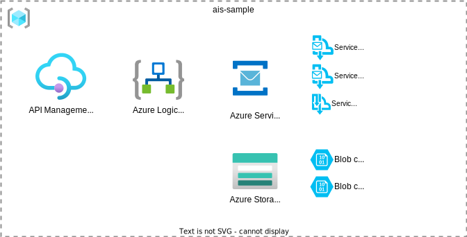
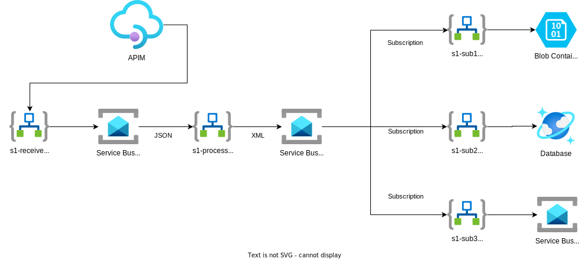
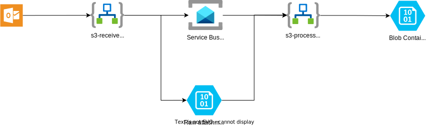

# AIS Samples   

This repo contains code and templates to help you get started with Azure Integration Services (AIS). The code and templates implement a few different integration scenarios that have been designed to cover a range of different AIS services and techniques. There a few different ways you can use this repo:

* You can deploy the code and templates in their entirety. This will give you a working environment that you can use to explore the capabilities of Azure Integration Services.
* You can deploy just the infrastrucutre templates, and build out the sample scenarios yourself.
* You can build out all of the required infrastructure and code, and use this repo as a reference.

# AIS Scenarios

The following scenarios are included in this repo:

### Scenario 1

A customer outside your organisation makes a call to a REST API with a JSON message. The message is transformed into canonical format (XML) and published to a topic.  The topic is subscribed to by 3 subscribers:

1. Subscriber 1: Receives the messsage and converts it to flat file format (CSV). The flat file is dropped into an Azure Blob Storage container.
2. Subscriber 2: Receives message and inserts it into a database table.
3. Subscriber 3: Receives the message and places it on a queue for further processing.

### Scenario 2

A record is inserted into a database table which raised a notification. The notification is processed, transforming the record in XML format and writing it to a SharePoint list

### Scenario 3

An email is received with an attachment. The attachment is processed and transformed into XML format. The XML is then placed in an Azure Blob Storage container.
	
# Infrastructure

In order to implement the above scenarios a number of Azure AIS Services are required:

* Azure Logic Apps
* Azure Service Bus
* Azure Cosmos DB (could be substituted with any other Azure database, e.g. PostgreSQL, SQL Server)
* Azure Storage Account

Under the `infra` folder you will find Bicep templates that will deploy the required infrastructure. The template can be deployed using the folling Azure CLI command (run from the `infra` folder):

```azurecli  
az group create --name rg-ais-samples --location australiaeast  
az deployment group create --resource-group rg-ais-samples --parameters ./sample.bicepparam
```

(Authorize connection)

(deploy app)

After the app is deployed run the following command to deploy the APIM artifacts:
    
```azurecli

az deployment group create --resource-group rg-ais-samples3 --template-file ./apim/apim.bicep --parameters apimInstanceName='ais-sample-apim-h526c7usqwoxa' logicAppName='ais-sample-logicapp-h526c7usqwoxa'

```

This will create the following resources which are used by the sample scenarios. 



### Notes

* In this deployment all services are deployed with public endpoints. This is for demonstration purposes only and should not be used in a production environment. For a more secure version of this infrastructure see the `infra-secure` folder.   
* The template generates a random suffix for the resources. This is to ensure that the name of the resources are unique accross Azure - for production deployments you should use a naming convention that is meaningful to your organisation.
* In this sample authentication between Azure services is implemented via managed identity. The template configures Logic Apps with an system generated identiy and grants the required permissions to the other services.
* All logic app workflows are deployed to the same logic app instance. Depending on your own requirements you may want to deploy these to separate instances.

Sharepoint and Mailbox

## Scenario 1



## Senario 2


## Scenario 3

