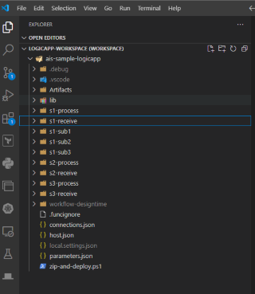
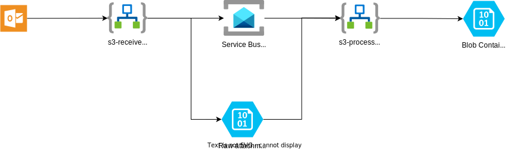

# AIS Samples   

This repo contains code and templates to help you get started with Azure Integration Services (AIS). The code and templates implement a few different integration scenarios that have been designed to cover a range of different AIS services and techniques. There a few different ways you can use this repo:

* You can deploy the code and templates in their entirety. This will give you a working environment that you can use to explore the capabilities of Azure Integration Services.
* You can deploy just the infrastrucutre templates, and build out the sample scenarios yourself.
* You can build out all of the required infrastructure and code, and use this repo as a reference.

# AIS Scenarios

The following scenarios are included in this repo:

### Scenario 1

A customer outside your organisation makes a call to a REST API with a JSON message. The message is transformed into canonical format (XML) and published to a topic.  The topic is subscribed to by 3 subscribers:

1. Subscriber 1: Receives the messsage and converts it to flat file format (CSV). The flat file is dropped into an Azure Blob Storage container.
2. Subscriber 2: Receives message and inserts it into a database table.
3. Subscriber 3: Receives the message and places it on a queue for further processing.

### Scenario 2

A record is inserted into a database table which raises a notification. The notification is processed, transforming the record in XML format and writing it to a SharePoint list

### Scenario 3

An email is received with an attachment. The attachment is placed in a blob storage container.  The size of the attachment is unknown.
	
# Deployment

To fully deploy the sample scenarions in this repo the following steps are required. These steps are detailed in the sections below:

1. Infrastructure Deployment
2. Office 365 Connection
3. Application Deployment - Logic App Workflows
4. Application Deployment - APIM Definitions

## Infrastructure Deployment

In order to implement the above scenarios a number of Azure AIS Services are required:

* Azure Logic Apps
* Azure API Management
* Azure Service Bus
* Azure Cosmos DB (could be substituted with any other Azure database, e.g. PostgreSQL, SQL Server)
* Azure Storage Account
* Azure Log Analytics 
* Azure Application Insights

Under the `infra` folder you will find Bicep templates that will deploy the required infrastructure. The template can be deployed using the folling Azure CLI command (run from the `infra` folder):

```azurecli  
az group create --name rg-ais-samples --location australiaeast  
az deployment group create --resource-group rg-ais-samples --parameters ./sample.bicepparam
```

This will create the following resources which are used by the sample scenarios. 


### Notes

* In this deployment all services are deployed with public endpoints. This is for demonstration purposes only and should not be used in a production environment. 
* The template generates a random suffix for the resources. This is to ensure that the name of the resources are unique accross Azure - for production deployments you should use a naming convention that is meaningful to your organisation.
* In this sample authentication between Azure services is implemented via managed identity were possible. The template configures Logic Apps with a system generated identiy and grants the required permissions to the other services. For resources where managed identity is not supported bt the Logic App connections (e.g. Azure Cosmos DB) the templates create KeyVault secrets for connection strings and reference these secrets from the Logic App configuration.
* All logic app workflows are deployed to the same logic app instance. Depending on your own requirements you may want to deploy these to separate instances.

### Office 365 Connection

After the deployment is completed you will need to authorize the Office 365 connector used by Scenarion 3. From the Azure Portal navigate to the `rg-ais-samples` resource group, and click into the `office365` API Connection.  Click on the error notification and then click "Authorize".  You will need to sign in with your Office 365 account, and the Inbox associated with this account will be used by Scenario 3.

## Application Deployment

With the infrastructure in place you can now deploy the Logic App Workflows and APIM configurations required to implement the sample scenarios.

### Logic App Workflows

There are two options to deploy the workflows:

1. Use a PowerShell script that creates a zip deployment package and uploads it to the Logic App:

    1. From PowerShell navigate to the `logicapp-workspace\ais-sample-logicapp` directory
    2. Run the `zip-and-deploy.ps1` using the following arguments:
  
        ``` 
        .\zip-and-deploy.ps1 <LOGIC APP NAME> <RESOURCE GROUP NAME>
        ```
        e.g
        ```
        .\zip-and-deploy.ps1 ais-sample-logicapp-x54elz3alby4a rg-ais-samples
        ```
2. Deploy the workflows from Visual Studio Code. The document [Create a Standard logic app workflow in single-tenant Azure Logic Apps using Visual Studio Code](https://learn.microsoft.com/en-us/azure/logic-apps/create-single-tenant-workflows-visual-studio-code) contains detailed instruction on how to create and deploy workfllow from Visual Studio Code, but in the case where we already have a workflow you can use the following steps:

    1. Follow the steps in the [Tools](https://learn.microsoft.com/en-us/azure/logic-apps/create-single-tenant-workflows-visual-studio-code#tools), [Set up Visual Studio Code](https://learn.microsoft.com/en-us/azure/logic-apps/create-single-tenant-workflows-visual-studio-code#set-up-visual-studio-code) and [Connecto to your Azure Account](https://learn.microsoft.com/en-us/azure/logic-apps/create-single-tenant-workflows-visual-studio-code#connect-to-your-azure-account) sections to set up your environment.
    2. Open the `logicapp-workspace\ais-sample-logicapp\logicapp-workspace.code-workspace` workspace in Visual Studio Code. You should see the workspace as follows:
            
    3. Skip to the [Deploy to Azure](https://learn.microsoft.com/en-us/azure/logic-apps/create-single-tenant-workflows-visual-studio-code#deploy-to-azure) section to deploy the workflows to Azure.  When prompted for the name of the Logic App instance use the name of the Logic App instance that was deployed above.

### APIM Definitions

The APIM API definitions and policies required for Scenario 1 are included in the `infra/apim` folder. The APIM configuration can be deployed using the following Azure CLI command - first get the names of the logic app and APIM instances that were deployed above, and update the appropriate parameters in the command below. Note that the APIs cannot be created until the Logic App workflows have been deployed as the HTTP trigger URL is required (and this contains a key that is generated when the workflow is deployed).

```azurecli
az deployment group create --resource-group rg-ais-samples --template-file ./apim/apim.bicep --parameters apimInstanceName='<APIM INSTANCE NAME>' logicAppName='<LOGIC APP NAME>'
```

## Local Development

To run the workflows locally you will to carry out the following steps:
1. Deploy the infrastructure as described in the "Infrastructure Deployment" section above. This is required as the workflows use a number of Azure services that need to be in place.
2. Set up your Visual Studio Code environment as described in the "Deploy the workflows from Visual Studio Code" section above.
3. Create configuration settings in local.settings.json for the connections used by the workflows. The output from the deployment of the main Azure resources will contain the keys and values that you need:

    ```
    serviceBus_fullyQualifiedNamespace 
    AzureCosmosDB_connectionString string 
    AzureBlob_blobStorageEndpoint string
    ```

# Running the Scenarios

## Scenario 1


To run this scenario POST the sample document `data/S1_JSON_input_simple.json` to the APIM API endpoint using an [APIM subscription key](https://learn.microsoft.com/en-us/azure/api-management/api-management-subscriptions).  You can use the following curl command to do this:

```
 Invoke-WebRequest -Uri https://<APIM NAME>.azure-api.net/sample-api/s1-receive -Method POST -UseBasicParsing -ContentType application/json -Headers @{"Ocp-Apim-Subscription-Key" = "<APIM KEY>"} -InFile .\data\S1_JSON_input_simple.json
```

The scenario branches into multiple child workflows using the a Service Bus topic and subscriptions.  To check the output of each branch you can use the Azure Portal to view the Logic App runs for the `s1-sub1`, `s1-sub2` and `s1-sub3` workflows, and the messages processes by the subscriptions of the `s1-processed` topic.  The output of each branch is as follows:

#### Subscriber 1:

Check the `s1-sub1-final` container in the `aisstorexxxxxx` storage account. You can use the Azure Portal to view the contents of the container.

#### Subscriber 2:

Check the `s1-sub2=final` container in the `ais-sample-cosmosdb-xxxxxx` Cosmos DB account. You can use the Azure Portal to view the contents of the container.

#### Subeciber 3:

Check the `s1-sub3-output` queue in the `ais-sample-servicebus-xxxxxx` Service Bus namespace. You can use the Azure Portal to view the contents of the queue.

## Senario 2


To run this scenario create a document in the `Employees` container in the `ais-samples-db` database. You can do this from the Azure Portal from the Data Explorer in the Cosmos DB account.  The document should have the following structure - note that the id field should be unique. If you are using the "New Item" function in Azure Portal CosmosDB Document Explorer then this field can be left blank and Cosmos DB will generate a unique id for you.

```json
{
    "id": "1",
    "name": "Jay Prakash",
    "position": "Testers",
    "joinyear": 2010,
    "salary": 7000
}
```
Note that in this scenario the receive workflow `s2-receive` does schema validation on the incoming message. If the message does not match the schema then the workflow will fail. You can test this by sending a message that does not match the schema - e.g. by changing the `joinyear` field to a string.

As implemented in the sample this scenario does not currently write any output to the SharePoint list. This is left as an exercise for the reader - you can update the workflow `s2-process` to implement the [Create file](https://learn.microsoft.com/en-us/connectors/sharepoint/#create-file) or [Create Item](https://learn.microsoft.com/en-us/connectors/sharepoint/#create-item) Sharepoint actions to complete the scenario.

## Scenario 3



To run this scenario send an email to the inbox associated with the Office 365 account that you authorized when creating the sample infrastructure. The email should have an attachment, and should have the tag "#ais-sample" in the subject.

To check the scenario has run successfully check the `s3-final` container in the `aisstorexxxxxx` storage account. You can use the Azure Portal to view the contents of the container.

